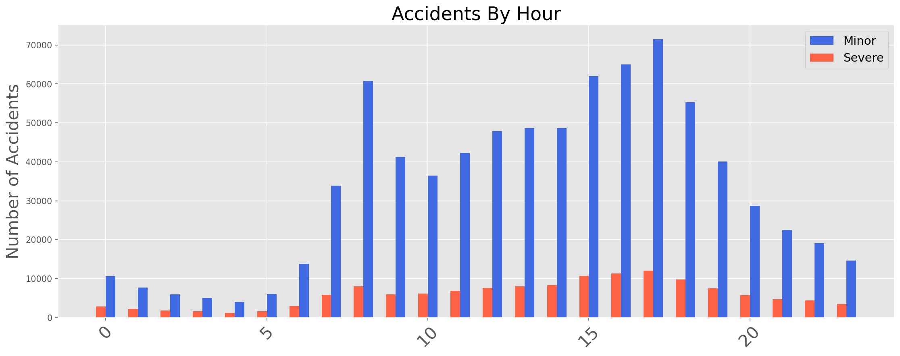

# United Kingdom Traffic Accidents and their Influencing Factors
## Background & Goal:
Road Traffic Accidents (RTA)s are a major cause of death globally, leading to around 1.25 million deaths annually. In the United Kingdom, the UK Department of Transport [(gov.uk)](https://data.gov.uk/dataset/cb7ae6f0-4be6-4935-9277-47e5ce24a11f/road-safety-data) provides detailed statistics about personal injury road accidents, vehicles and casualties involved. Most of the statistics are based on road accidents reported to the police (Stats19). 

The goal of this repository is to help emergency services identify the key elements leading to severe accidents, helping staffing needs of where and when they are most needed. hopefully reducing tragedies and statistics alike.

## Data:

Data is made up of two datasets that recorded traffic accidents around the UK from 2009-2011 and 2012-2014. There are over 900,000 records and over 30 different features.

Features are broken down into Categorical and Numerical Data. After combining datasets and dealing with nulls, I wanted to look at Accident Severity as my target variable. Initially, The breakdown for Severity was Fatal, Serious, Slight, so I merged that into a binary severe (1) or not severee (0). In  picking Accident Severity as my target, I concluded that I would need to exlude certain features from my analysis that would result from the accident already taking place such as Number of Casualties, Number of Vehicles, and whether attended the scene. The table below shows my sorted and filtered dataframe. 

|   | Accident_Index | Police_Force | Longitude | Latitude  | Accident_Severity | Number_of_Vehicles | Number_of_Casualties | Date   | Time  | Road_Type          | Speed_limit | Weather_Conditions      | Pedestrian_Crossing-Physical_Facilities     | Light_Conditions               | Road_Surface_Conditions | Urban_or_Rural_Area | Did_Police_Officer_Attend_Scene_of_Accident |
|---|----------------|--------------|-----------|-----------|-------------------|--------------------|----------------------|--------|-------|--------------------|-------------|-------------------------|---------------------------------------------|--------------------------------|-------------------------|---------------------|---------------------------------------------|
| 0 | 200901BS70001  | 1            | -0.201349 | 51.512273 | 1                 | 2                  | 1                    | 1/1/09 | 15:11 | One way street     | 30          | Fine without high winds | No physical crossing within 50 meters       | Daylight: Street light present | Dry                     | 1                   | Yes                                         |
| 1 | 200901BS70002  | 1            | -0.199248 | 51.514399 | 1                 | 2                  | 11                   | 5/1/09 | 10:59 | Single carriageway | 30          | Fine without high winds | Zebra crossing                              | Daylight: Street light present | Wet/Damp                | 1                   | Yes                                         |
| 2 | 200901BS70003  | 1            | -0.179599 | 51.486668 | 0                 | 2                  | 1                    | 4/1/09 | 14:19 | Single carriageway | 30          | Fine without high winds | No physical crossing within 50 meters       | Daylight: Street light present | Dry                     | 1                   | Yes                                         |
| 3 | 200901BS70004  | 1            | -0.20311  | 51.507804 | 1                 | 2                  | 1                    | 5/1/09 | 8:10  | Single carriageway | 30          | Other                   | Pedestrian phase at traffic signal junction | Daylight: Street light present | Frost/Ice               | 1                   | Yes                                         |

## EDA:
Start and see where outside research and intuition could take me

Performed Feature Engineering with regards to Inferential Regression

Inferential Assumptions:
1. Linearity: the relationship between the X and the y can be modeled linearly 
2. Independence: the residuals should be independent from each other 
3. Normality: the residuals are normally distributed 
4. Homoscedasticity: the variance of the residuals is constant 
5. No multicollinearity: the independent variables are not highly correlated with each other 

* Day of Week chart
    * Weekend vs not

* Time of Day
    * Rush

* Speed Limit
    * Higher proportion at faster speeds

 Urban             |  Rural
:-------------------------:|:-------------------------:
  |  

## Inferential Logistic Regression

Determined Multicolinearity with Variance Inflation Factor (VIF). As the name suggests, a variance inflation factor (VIF) quantifies how much the variance is inflated. But what variance? A variance inflation factor exists for each of the predictors in a multiple regression model. A VIF of 1 means that there is no correlation, while VIFs exceeding 10 are signs of serious multicollinearity requiring correction. In the data, I dropped Latitude and Longitude due to their high values, both exceeding 20. 

Due to the abudance of categorical features, there are several columns that need to be one-hot encoded or changed to a binary value in order to utilize thee features. By dropping one of the one-hot encoded columns from each categorical feature, we ensure there are no "reference" columns — the remaining columns become linearly independent. These features included: 

* Road Surface: Dry, Wet or damp, Snow, Frost or ice, Flood over 3cm. deep, Oil or diesel
* Road Type: Roundabout, One way street, Dual carriageway, Single carriageway, Slip road
* Weather: Fine no high winds, Raining no high winds, Snowing no high winds, Fine + high winds, Fog or mist
* Light Conditions: Daylight, Darkness - lights lit, Darkness - lights unlit
* Pedestrian Crossing Physical: Zebra, Footbridge or subway, Pedestrian phase at traffic signal junction

Balanced data so Severe and Non-Severe were equal

Standarized the data in order to be able to compare coefficients

| Feature                                     | Coeff |
|---------------------------------------------|-------|
| Road_Type_Slip road                         | -0.7  |
| Road_Type_Roundabout                        | -0.58 |
| Pedestrian_Crossing-Physical_Central refuge | 4     |
| Road_Surface_Conditions_Snow                | 0.38  |
| Road_Type_Dual carriageway                  | 0.37  |

* Pseudo R-squared: 0.020 
* AIC:              383070.2290
* BIC:              383386.7042

## Conclusion & Future Direction

* Perform a predictive model to determine future accidents

* Continue training this model to improve its accuracy - an R-squared of 0.02 is not enough

* Compare feature importance with other models such as random forest and XGBoost

* Look into other features as target variables such as Number of Casualties or Number of Vehicles to see if it improves the model. 

